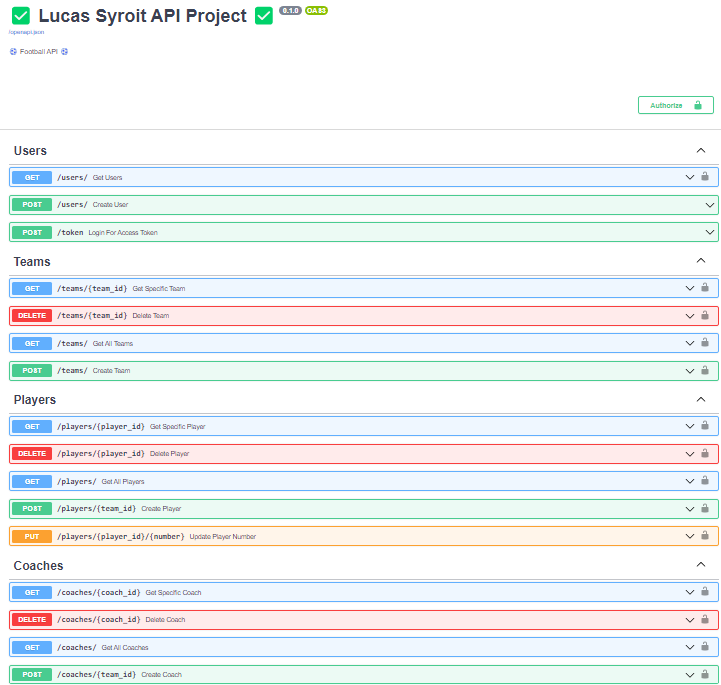

# API-eindproject

## Table of Contents

1. [Theme](#theme)
2. [API](#api)
3. [Extensions](#extensions)
4. [Postman](#postman)
5. [OpenAPI Docs](#openapi-docs)

## Theme

Ik heb gekozen voor een API te maken rond voetbal, waar je de mogelijkheid krijgt om teams toe te voegen daarnaast ook spelers en coaches kan toevoegen.

Ik heb hiervoor gekozen omdat voetbal een sport is die mij interesseerd daarnaast ook heel wat data met zich meebrengt. Deze API is dus zeker nog uitbreidbaar.

## API

### main.py

### database.py

### models.py

### schemas.py

### crud.py

### auth.py

### test_main.py

### Dockerfile

### Okteto

## Uitbreidingen

### 2.1 Test alle niet-GET endpoints.

#### test_main.py

### 2.2 Zorg ervoor dat de testfile ook tijdens de GitHub Actions gerund wordt.

#### workflow.yml

```yaml
name: Deliver container

on: push

jobs:
  delivery:
    runs-on: ubuntu-latest
    name: Deliver container
    steps:
      - name: Check out repository
        uses: actions/checkout@v1

      - name: Set up Python 3.11
        uses: actions/setup-python@v2
        with:
          python-version: 3.11

      - name: Install dependencies
        run: |
          python -m pip install --upgrade pip
          pip install -r requirements.txt
          pip install uvicorn
          pip install pytest
          pip install argon2_cffi
          pip install python-jose[cryptography]
          pip install python-multipart

      - name: Create SQLite database
        run: |
          cd myproject
          mkdir -p sqlitedb
          sqlite3 sqlitedb/data.db ".databases"

      - name: Start Uvicorn server
        run: |
          cd myproject
          uvicorn main:app --host 0.0.0.0 --port 8000 & sleep 10

      - name: Run tests
        run: pytest test_main.py

      - name: Docker login
        run: docker login -u ${{ secrets.DOCKER_USER }} -p ${{ secrets.DOCKER_PASSWORD }}

      - name: Docker Build
        run: docker build -t ${{ secrets.DOCKER_USER }}/api-eindproject:latest .

      - name: Upload container to Docker Hub with Push
        run: docker push ${{ secrets.DOCKER_USER }}/api-eindproject:latest
```

1. Check out repository
   - Deze stap gebruikt een actie actions/checkout@v1 om een clone te maken van de repository.
2. Set up Python 3.11
   - Deze stap gebruikt een actie actions/setup-python@v2 om een python omgeving op te zetten met python-versie 3.11
3. Install dependencies
   - installeert de benodigde Python-pakketten voor het project met behulp van pip
4. Create SQLite database
   - In deze stap wordt er een nieuwe map sqlitedb - als het nog niet bestaat - aangemaakt in de myproject map. Creeërt hierin een nieuwe SQLite database data.db.
5. Start Uvicorn server
   - Deze stap start een Uvicorn-server om de FastAPI-applicatie te bedienen. De server wordt op de achtergrond gestart en de workflow wacht 10 seconden om de server tijd te geven om op te starten.
6. Run tests
   - Deze stap zal de test runnen om de endpoints van de API te testen dit gebeurd met pytest.
7. Docker login
   - Meldt aan bij Docker met de gebruikersnaam en het wachtwoord die zijn opgeslagen in de secrets van de repository.
8. Docker build
   - Deze stap gaat de docker image maken van de applicatie door gebruiken te maken van de Dockerfile. De image wordt getagged met de gebruikersnaam.
9. Upload container to Docker Hub with Push
   - Deze stap zal de docker image naar docker hub pushen.

## Postman

## OpenAPI Docs

### Algemeen overzicht

Zonder geauthoriseerd te zijn.


### Users

### Teams

### Players

### Coaches
