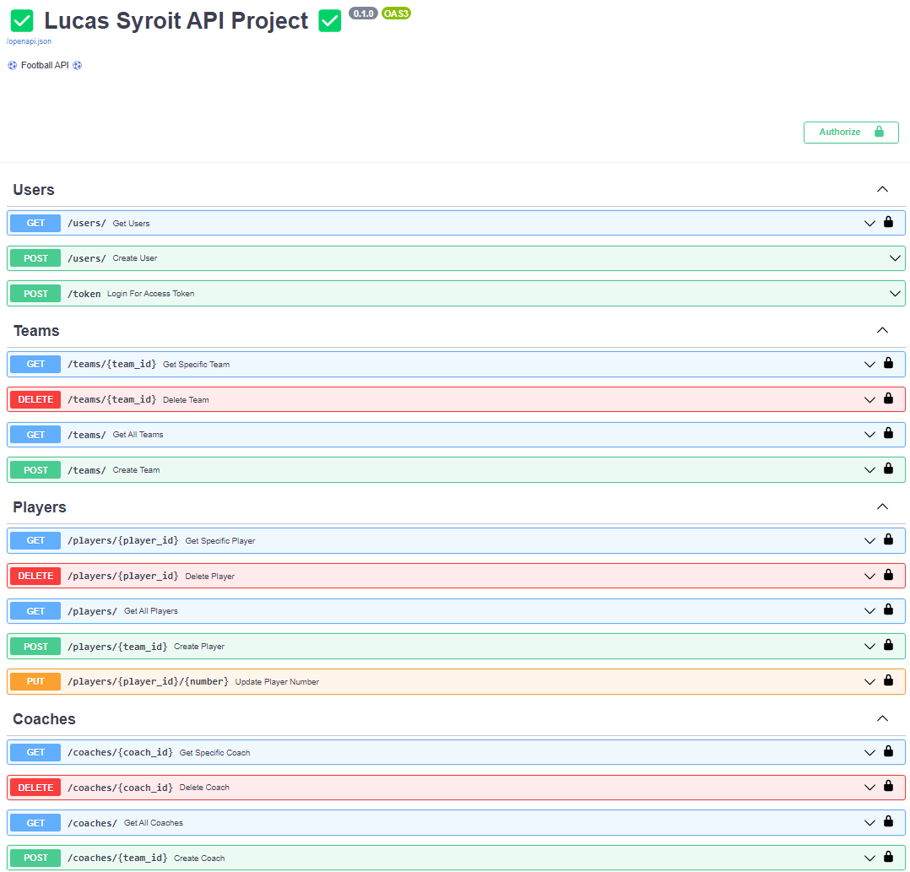
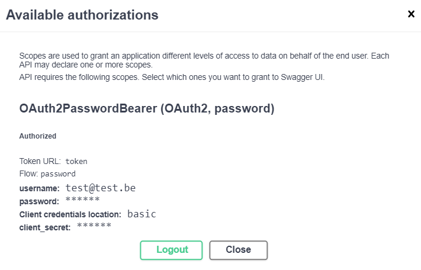
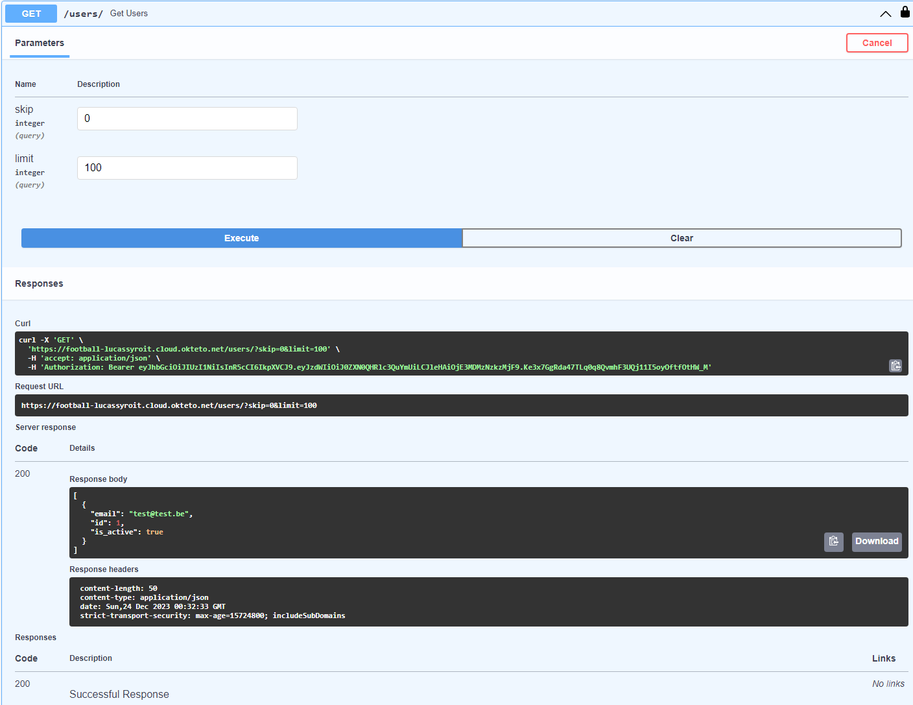
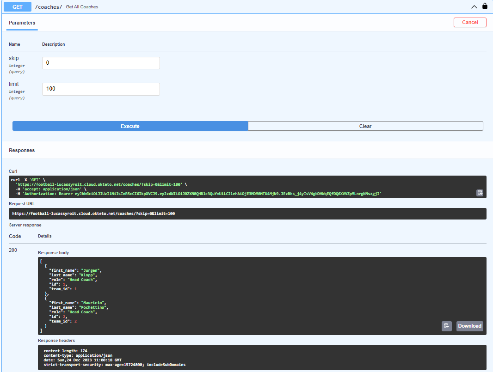

# API-eindproject

## Table of Contents

1. [Theme](#theme)
2. [API](#api)
3. [Uitbreidingen](#uitbreidingen)
4. [Postman](#postman)
5. [OpenAPI Docs](#openapi-docs)

## Theme

Ik heb gekozen voor een API te maken rond voetbal, waar je de mogelijkheid krijgt om teams toe te voegen daarnaast ook spelers en coaches kan toevoegen.

Ik heb hiervoor gekozen omdat voetbal een sport is die mij interesseerd daarnaast ook heel wat data met zich meebrengt. Deze API is dus zeker nog uitbreidbaar.

## API

### main.py

In main.py staat de code voor de endpoints. In totaal heb ik 7 GET endpoints, 5 POST, 1 PUT en 3 DELETE.

Naast code voor de endpoints wordt er ook de database inialisatie gedaan. In de endpoints staan ook tags om in de docs van de API een verdeling te hebben.

```python
# Imports
from fastapi import Depends, FastAPI, HTTPException, status
from sqlalchemy.orm import Session
from fastapi.middleware.cors import CORSMiddleware
import os
import crud
import models
import schemas
from fastapi.security import OAuth2PasswordBearer, OAuth2PasswordRequestForm
import auth
from database import SessionLocal, engine
from typing import List
# import stomp
# import urllib.parse


# Database Initialization
print("We are in the main.......")
if not os.path.exists('.\sqlitedb'):
    print("Making folder.......")
    os.makedirs('.\sqlitedb')

print("Creating tables.......")
models.Base.metadata.create_all(bind=engine)
print("Tables created.......")

# ActiveMQ Connection Setup
# active_mq_broker_url = os.getenv("ACTIVE_MQ_BROKER_URL", "https://activemq-lucassyroit-61616-lucassyroit.cloud.okteto.net")
# parsed_url = urllib.parse.urlparse(active_mq_broker_url)
# print("ActiveMQ Broker URL: " + active_mq_broker_url)
# connection = stomp.Connection(host_and_ports=[parsed_url.hostname])
# connection.start()
# connection.connect(wait=True)


# Custom function to send messages to ActiveMQ
# def send_message_to_activemq(destination, message):
#     connection.send(body=message, destination=destination)


# FastAPI App Setup
app = FastAPI(title="✅ Lucas Syroit API Project ✅", description="⚽ Football API ⚽")

origins = [
    "http://localhost",
    "http://localhost:8080",
    "https://localhost.tiangolo.com",
    "http://127.0.0.1:5500"
]

app.add_middleware(
    CORSMiddleware,
    allow_origins=origins,
    allow_credentials=True,
    allow_methods=["*"],
    allow_headers=["*"],
)


# Database Dependency
def get_db():
    db = SessionLocal()
    try:
        yield db
    finally:
        db.close()


oauth2_scheme = OAuth2PasswordBearer(tokenUrl="token")


# GET Endpoints
# Endpoint to get all users
@app.get("/users/", response_model=list[schemas.User], tags=["Users"])
def get_users(skip: int = 0, limit: int = 100, db: Session = Depends(get_db), token: str = Depends(oauth2_scheme)):
    users = crud.get_users(db, skip=skip, limit=limit)
    return users


# Endpoint to get a specific team
@app.get("/teams/{team_id}", response_model=schemas.Team, tags=["Teams"])
def get_specific_team(team_id: int, db: Session = Depends(get_db), token: str = Depends(oauth2_scheme)):
    team = crud.get_team(db, team_id)
    if team is None:
        raise HTTPException(status_code=status.HTTP_404_NOT_FOUND, detail="Team not found")
    return team


# Endpoint to get a specific player
@app.get("/players/{player_id}", response_model=schemas.Player, tags=["Players"])
def get_specific_player(player_id: int, db: Session = Depends(get_db), token: str = Depends(oauth2_scheme)):
    player = crud.get_player(db, player_id)
    if player is None:
        raise HTTPException(status_code=status.HTTP_404_NOT_FOUND, detail="Player not found")
    return player


# Endpoint to get a specific coach
@app.get("/coaches/{coach_id}", response_model=schemas.Coach, tags=["Coaches"])
def get_specific_coach(coach_id: int, db: Session = Depends(get_db), token: str = Depends(oauth2_scheme)):
    coach = crud.get_coach(db, coach_id)
    if coach is None:
        raise HTTPException(status_code=status.HTTP_404_NOT_FOUND, detail="Coach not found")
    return coach


# Endpoint to get all teams
@app.get("/teams/", response_model=List[schemas.Team], tags=["Teams"])
def get_all_teams(skip: int = 0, limit: int = 100, db: Session = Depends(get_db), token: str = Depends(oauth2_scheme)):
    return crud.get_teams(db, skip=skip, limit=limit)


# Endpoint to get all players
@app.get("/players/", response_model=List[schemas.Player], tags=["Players"])
def get_all_players(skip: int = 0, limit: int = 100, db: Session = Depends(get_db), token: str = Depends(oauth2_scheme)):
    return crud.get_players(db, skip=skip, limit=limit)


# Endpoint to get all coaches
@app.get("/coaches/", response_model=List[schemas.Coach], tags=["Coaches"])
def get_all_coaches(skip: int = 0, limit: int = 100, db: Session = Depends(get_db), token: str = Depends(oauth2_scheme)):
    return crud.get_coaches(db, skip=skip, limit=limit)


# POST Endpoints
# POST endpoint to send message to ActiveMQ
# @app.post("/send-to-activemq", tags=["ActiveMQ"])
# def send_to_activemq(message: str, destination: str):
#     send_message_to_activemq(destination, message)
#     return {"message": "Message sent to ActiveMQ"}


# POST endpoint to get a token for authorization
@app.post("/token", tags=["Users"])
def login_for_access_token(form_data: OAuth2PasswordRequestForm = Depends(), db: Session = Depends(get_db)):
    #Try to authenticate the user
    user = auth.authenticate_user(db, form_data.username, form_data.password)
    if not user:
        raise HTTPException(
            status_code=401,
            detail="Incorrect username or password",
            headers={"WWW-Authenticate": "Bearer"},
        )
    # Add the JWT case sub with the subject(user)
    access_token = auth.create_access_token(
        data={"sub": user.email}
    )
    # Return the JWT as a bearer token to be placed in the headers
    return {"access_token": access_token, "token_type": "bearer"}


# POST endpoint to create a user
@app.post("/users/", response_model=schemas.User, tags=["Users"])
def create_user(user: schemas.UserCreate, db: Session = Depends(get_db)):
    db_user = crud.get_user_by_email(db, email=user.email)
    if db_user:
        raise HTTPException(status_code=400, detail="Email already registered")
    return crud.create_user(db=db, user=user)


# POST endpoint to create a team
@app.post("/teams/", response_model=schemas.Team, tags=["Teams"])
def create_team(team: schemas.TeamCreate, db: Session = Depends(get_db), token: str = Depends(oauth2_scheme)):
    return crud.create_team(db, team)


# Endpoint to create a player on a team
@app.post("/players/{team_id}", response_model=schemas.Player, tags=["Players"])
def create_player(team_id: int, player: schemas.PlayerCreate, db: Session = Depends(get_db), token: str = Depends(oauth2_scheme)):
    return crud.create_player(db, player, team_id)


# Endpoint to create a coach on a team
@app.post("/coaches/{team_id}", response_model=schemas.Coach, tags=["Coaches"])
def create_coach(team_id: int, coach: schemas.CoachCreate, db: Session = Depends(get_db), token: str = Depends(oauth2_scheme)):
    return crud.create_coach(db, coach, team_id)


# PUT endpoints
# Endpoint to update a players shirt number
@app.put("/players/{player_id}/{number}", response_model=schemas.Player, tags=["Players"])
def update_player_number(player_id: int, number: int, db: Session = Depends(get_db), token: str = Depends(oauth2_scheme)):
    player = crud.get_player(db, player_id)
    if player is None:
        raise HTTPException(status_code=404, detail="Player not Found")
    player.number = number
    db.commit()
    return {"message": "Player number has been updated"}


# DELETE Endpoints
# Endpoint to delete a team, also all players and coaches in the team will be deleted.
@app.delete("/teams/{team_id}", tags=["Teams"])
def delete_team(team_id: int, db: Session = Depends(get_db), token: str = Depends(oauth2_scheme)):
    if not crud.remove_team(db, team_id):
        raise HTTPException(status_code=404, detail="Team not found")
    return {"message": "Team (Including Players and Coaches) deleted"}


# Endpoint to delete a player
@app.delete("/players/{player_id}" , tags=["Players"])
def delete_player(player_id: int, db: Session = Depends(get_db), token: str = Depends(oauth2_scheme)):
    if not crud.remove_player(db, player_id):
        raise HTTPException(status_code=404, detail="Player not found")
    return {"message": "Player deleted"}


# Endpoint to delete a coach
@app.delete("/coaches/{coach_id}", tags=["Coaches"])
def delete_coach(coach_id: int, db: Session = Depends(get_db), token: str = Depends(oauth2_scheme)):
    if not crud.remove_coach(db, coach_id):
        raise HTTPException(status_code=404, detail="Coach not found")
    return {"message": "Coach deleted"}


# Close ActiveMQ connection when the application shuts down
# @app.on_event("shutdown")
# def shutdown_event():
#     connection.disconnect()

```

### database.py

Deze code stelt de SQLAlchemy-componenten in voor het werken met een SQLite-database in de API.

```python
from sqlalchemy import create_engine
from sqlalchemy.ext.declarative import declarative_base
from sqlalchemy.orm import sessionmaker

SQLALCHEMY_DATABASE_URL = "sqlite:///./sqlitedb/data.db"

engine = create_engine(
    SQLALCHEMY_DATABASE_URL, echo=True, connect_args={"check_same_thread": False}
)
SessionLocal = sessionmaker(autocommit=False, autoflush=False, bind=engine)

Base = declarative_base()
```

### models.py

In models.py worden alle tabellen voor de database aangemaakt. In mijn geval de tabel Users, Teams, Players en coaches. De tabel Users zal de accounts bevatten van de API met gehashde wachtwoorden.

De tabel team houdt de voetbalploegen bij, spelers en coaches van een bepaald team worden ook in de respectievelijke tabellen bijgehouden.

Er zijn ook relaties aangemaakt zodat de tabel players en coaches bij de tabel van teams horen.

```python
from sqlalchemy import Column, Integer, String, Boolean, Date, ForeignKey
from sqlalchemy.orm import relationship
from database import Base


class User(Base):
    __tablename__ = "users"
    id = Column(Integer, primary_key=True, index=True)
    email = Column(String, unique=True, index=True)
    hashed_password = Column(String)
    is_active = Column(Boolean, default=True)


class Team(Base):
    __tablename__ = "teams"
    id = Column(Integer, primary_key=True, index=True)
    name = Column(String, unique=True, index=True)
    city = Column(String, index=True)
    stadium = Column(String, index=True)
    founded_year = Column(Integer,  index=True)

    # Define relationship for team and players models
    players = relationship("Player", back_populates="team", cascade="all, delete-orphan")
    coaches = relationship("Coach", back_populates="team", cascade="all, delete-orphan")


class Player(Base):
    __tablename__ = "players"
    id = Column(Integer, primary_key=True, index=True)
    first_name = Column(String,  index=True)
    last_name = Column(String,  index=True)
    position = Column(String,  index=True)
    nationality = Column(String,  index=True)
    number = Column(Integer,  index=True)
    birthdate = Column(String, nullable=True)

    # Foreign Key player --> team
    team_id = Column(Integer, ForeignKey("teams.id"))
    # Define relationship for team and players models
    team = relationship("Team", back_populates="players")


class Coach(Base):
    __tablename__ = "coaches"
    id = Column(Integer, primary_key=True, index=True)
    first_name = Column(String, index=True)
    last_name = Column(String, index=True)
    role = Column(String, index=True)

    # Foreign key to connect Coach to Team
    team_id = Column(Integer, ForeignKey('teams.id'))

    # Define a back-reference to the Team model
    team = relationship("Team", back_populates="coaches")

```

### schemas.py

Deze code definieert Pydantic-modellen voor het werken met gegevens in de API.

```python
from pydantic import BaseModel
from typing import List, Optional

# User Schemas


class UserBase(BaseModel):
    email: str


class UserCreate(UserBase):
    password: str


class User(UserBase):
    id: int
    is_active: bool

    class Config:
        orm_mode = True


# Player Schemas
class PlayerBase(BaseModel):
    first_name: str
    last_name: str
    position: str
    nationality: str
    number: int
    birthdate: str


class PlayerCreate(PlayerBase):
    pass


class Player(PlayerBase):
    id: int
    team_id: int

    class Config:
        orm_mode = True

# Coach Schemas
class CoachBase(BaseModel):
    first_name: str
    last_name: str
    role: str


class CoachCreate(CoachBase):
    pass


class Coach(CoachBase):
    id: int
    team_id: int

    class Config:
        orm_mode = True


# Team Schemas
class TeamBase(BaseModel):
    name: str
    city: str
    stadium: str
    founded_year: int


class TeamCreate(TeamBase):
    pass


class Team(TeamBase):
    id: int
    players: List[Player] = []
    coaches: List[Coach] = []

    class Config:
        orm_mode = True

```

### crud.py

In crud.py worden create, read, update en delete activiteiten geplaats die met de database gaan communiceren en verzorgen van de endpoints van de API.

```python

from sqlalchemy.orm import Session
from fastapi import HTTPException, status
from datetime import datetime
from typing import List

import auth
import models
import schemas

# User CRUD Operations


def get_user(db: Session, user_id: int):
    return db.query(models.User).filter(models.User.id == user_id).first()


def get_user_by_email(db: Session, email: str):
    return db.query(models.User).filter(models.User.email == email).first()


def create_user(db: Session, user: schemas.UserCreate):
    hashed_password = auth.get_password_hash(user.password)
    db_user = models.User(email=user.email, hashed_password=hashed_password)
    db.add(db_user)
    db.commit()
    db.refresh(db_user)
    return db_user


def get_users(db: Session, skip: int = 0, limit: int = 100):
    return db.query(models.User).offset(skip).limit(limit).all()


# Team CRUD Operations

def create_team(db: Session, team: schemas.TeamCreate):
    db_team = models.Team(
        name=team.name,
        city=team.city,
        stadium=team.stadium,
        founded_year=team.founded_year,
    )
    db.add(db_team)
    db.commit()
    db.refresh(db_team)
    return db_team


def get_teams(db: Session, skip: int = 0, limit: int = 100):
    return db.query(models.Team).offset(skip).limit(limit).all()


def get_team(db: Session, team_id: int):
    return db.query(models.Team).filter(models.Team.id == team_id).first()


def remove_team(db: Session, team_id: int):
    team = db.query(models.Team).filter(models.Team.id == team_id).first()
    if team is not None:
        db.delete(team)
        db.commit()
        return {"message": "Team (Also included players and coaches in the team) has been successfully deleted"}
    else:
        raise HTTPException(status_code=status.HTTP_404_NOT_FOUND, detail="Team not found")

# Player CRUD Operations


def create_player(db, player_data, team_id):
    # Create the player instance and add it to the database
    db_player = models.Player(
        first_name=player_data.first_name,
        last_name=player_data.last_name,
        position=player_data.position,
        nationality=player_data.nationality,
        number=player_data.number,
        birthdate=player_data.birthdate,
        team_id=team_id,
    )
    db.add(db_player)
    db.commit()
    db.refresh(db_player)

    return db_player


def get_players(db: Session, skip: int = 0, limit: int = 100):
    return db.query(models.Player).offset(skip).limit(limit).all()


def get_player(db: Session, player_id: int):
    return db.query(models.Player).filter(models.Player.id == player_id).first()


def remove_player(db: Session, player_id: int):
    player = db.query(models.Player).filter(models.Player.id == player_id).first()
    if player:
        db.delete(player)
        db.commit()
        return {"message": "Player has been successfully deleted"}
    else:
        raise HTTPException(status_code=status.HTTP_404_NOT_FOUND, detail="Player not found")

# Coach CRUD Operations


def create_coach(db: Session, coach: schemas.CoachCreate, team_id: int):
    db_coach = models.Coach(
        first_name=coach.first_name,
        last_name=coach.last_name,
        role=coach.role,
        team_id=team_id,
    )
    db.add(db_coach)
    db.commit()
    db.refresh(db_coach)
    return db_coach


def get_coaches(db: Session, skip: int = 0, limit: int = 100):
    return db.query(models.Coach).offset(skip).limit(limit).all()


def get_coach(db: Session, coach_id: int):
    return db.query(models.Coach).filter(models.Coach.id == coach_id).first()


def remove_coach(db: Session, coach_id: int):
    coach = db.query(models.Coach).filter(models.Coach.id == coach_id).first()
    if coach:
        db.delete(coach)
        db.commit()
        return {"message": "Coach has been successfully deleted"}
    else:
        raise HTTPException(status_code=status.HTTP_404_NOT_FOUND, detail="Coach not found")


```

### auth.py

auth.py zorgt voor authenticate en autorizatie in de API. Er worden fucnties opgesteld voor het hashen van wachtwoorden voor het veilig houden van het wachtwoord in de datbase. Daarnaast ook authenticatie functies voor het gebruik van de API.

```python
from passlib.context import CryptContext
import crud
from sqlalchemy.orm import Session
from jose import JWTError, jwt
from datetime import datetime, timedelta
from fastapi.security import OAuth2PasswordBearer
from fastapi import Depends, HTTPException, status

oauth2_scheme = OAuth2PasswordBearer(tokenUrl="token")

SECRET_KEY = "7632ac60242b77b05956f402e9bd879b5ea1aff8e5090a6a22857fb14ed12f6d"
ALGORITHM = "HS256"
ACCESS_TOKEN_EXPIRE_MINUTES = 30
pwd_context = CryptContext(schemes=["argon2", "bcrypt"], deprecated="auto")


def get_password_hash(password):
    return pwd_context.hash(password)


def verify_password(plain_password, hashed_password):
    return pwd_context.verify(plain_password, hashed_password)


def authenticate_user(db: Session, username: str, password: str):
    user = crud.get_user_by_email(db, username)
    if not user:
        return False
    if not verify_password(password, user.hashed_password):
        return False
    return user


def create_access_token(data: dict):
    to_encode = data.copy()
    expires_delta = timedelta(minutes=ACCESS_TOKEN_EXPIRE_MINUTES)
    if expires_delta:
        expire = datetime.utcnow() + expires_delta
    else:
        # Default to 15 minutes of expiration time if ACCESS_TOKEN_EXPIRE_MINUTES variable is empty
        expire = datetime.utcnow() + timedelta(minutes=15)
    # Adding the JWT expiration time case
    to_encode.update({"exp": expire})
    encoded_jwt = jwt.encode(to_encode, SECRET_KEY, algorithm=ALGORITHM)
    return encoded_jwt


def get_current_user(db: Session, token: str = Depends(oauth2_scheme)):
    credentials_exception = HTTPException(
        status_code=status.HTTP_401_UNAUTHORIZED,
        detail="Could not validate credentials",
        headers={"WWW-Authenticate": "Bearer"},
    )
    try:
        payload = jwt.decode(token, SECRET_KEY, algorithms=[ALGORITHM])
        username: str = payload.get("sub")
        if username is None:
            raise credentials_exception
    except JWTError:
        raise credentials_exception
    user = crud.get_user_by_email(db, username)
    if user is None:
        raise credentials_exception
    return user


def get_current_active_user(db: Session, token: str = Depends(oauth2_scheme)):
    current_user = get_current_user(db, token)
    if not current_user.is_active:
        raise HTTPException(status_code=400, detail="Inactive user")
    return current_user
```


### test_main.py

Voor het testen van de GET endpoints van de API heb ik een variable waar de API wordt op gehost meegegeven om deze bij de request niet altijd aan te passen.

Daarnaast is er een helper functie gemaakt, deze gaat een bearer token opvragen met username en wachtwoord zodat je je token kan gebruiken in je endpoints voor authorizatie.

In elke test voor de GET endpoint wordt deze helper functie opgeroepen om de bearer token te verkrijgen om als header te gebruiken in de request. Daarnaast wordt er een request gestuurd naar het endpoint en wordt deze gecontrolleerd op HTTP code 200.

```python

import requests
import json

BASE_URL = "http://127.0.0.1:8000"

# Helper function to get a valid access token
def get_access_token():
    data = {
        "client_id": "",
        "client_secret": "",
        "scope": "",
        "grant_type": "",
        "refresh_token": "",
        "username": "test@test.be",
        "password": "test"
    }
    response = requests.post(f"{BASE_URL}/token", json=data)
    access_token = response.json().get("access_token")
    headers_with_token = {
        "accept": "application/json",
        "Authorization": f'Bearer {access_token}'
    }
    return headers_with_token


# test GET endpoints
# test to get teams
def test_get_all_teams():
    headers_with_token = get_access_token()
    response = requests.get(f"{BASE_URL}/teams/", headers=headers_with_token)
    assert response.status_code == 200


# test to get specific team
def test_get_specific_team():
    headers_with_token = get_access_token()
    response = requests.get(f"{BASE_URL}/teams/1", headers=headers_with_token)
    assert response.status_code == 200

# test to get players
def test_get_all_players():
    headers_with_token = get_access_token()
    response = requests.get(f"{BASE_URL}/players", headers=headers_with_token)
    assert response.status_code == 200


# test to get specific player
def test_get_specific_player():
    headers_with_token = get_access_token()
    response = requests.get(f"{BASE_URL}/players/1", headers=headers_with_token)
    assert response.status_code == 200


# test to get coaches
def test_get_all_coaches():
    headers_with_token = get_access_token()
    response = requests.get(f"{BASE_URL}/coaches", headers=headers_with_token)
    assert response.status_code == 200


# test to get specific coach
def test_get_specific_coaches():
    headers_with_token = get_access_token()
    response = requests.get(f"{BASE_URL}/coaches/1", headers=headers_with_token)
    assert response.status_code == 200

```

### Dockerfile

### Okteto

Link naar de gehoste API: https://football-lucassyroit.cloud.okteto.net


## Uitbreidingen

### 2.1 Test alle niet-GET endpoints.

#### test_main.py

Daarnaast heb ik ook de andere endpoints getest waar ik zelf ook data meegeef om de POST endpoints te testen. In de request wordt ook deze data meegestuurd zoals de header met de bearer token in.

Daarnaast wordt het PUT endpoint en DELETE endpoints ook getest. Het maken van een gebruiker en het opvragen van een token gebeurd zonder header aangezien deze geen authorizatie nodig hebben om gebruikt te worden.

```python

import requests
import json

BASE_URL = "http://127.0.0.1:8000"


# test POST endpoints
# Test to create user
def test_create_user():
    data = {"email": "test@test.be", "password": "test"}
    response = requests.post(f"{BASE_URL}/users/", json=data)
    assert response.status_code == 200


# Helper function to get a valid access token
def get_access_token():
    data = {
        "client_id": "",
        "client_secret": "",
        "scope": "",
        "grant_type": "",
        "refresh_token": "",
        "username": "test@test.be",
        "password": "test"
    }
    response = requests.post(f"{BASE_URL}/token", json=data)
    access_token = response.json().get("access_token")
    headers_with_token = {
        "accept": "application/json",
        "Authorization": f'Bearer {access_token}'
    }
    return headers_with_token


# test to create team
def test_create_team():
    headers_with_token = get_access_token()
    data = {
        "name": "Liverpool FC",
        "city": "Liverpool",
        "stadium": "Anfield",
        "founded_year": 1892
    }
    response = requests.post(f"{BASE_URL}/teams/", json=data, headers=headers_with_token)
    assert response.status_code == 200


# test to create player
def test_create_player():
    headers_with_token = get_access_token()
    data = {
        "first_name": "Mohamed",
        "last_name": "Salah",
        "position": "RW",
        "nationality": "Egypt",
        "number": 11,
        "birthdate": "15-06-1992",
    }
    response = requests.post(f"{BASE_URL}/players/1", json=data, headers=headers_with_token)
    assert response.status_code == 200


# test to create coach
def test_create_coach():
    headers_with_token = get_access_token()
    data = {
        "first_name": "Jurgen",
        "last_name": "Klopp",
        "role": "Head Coach"
    }
    response = requests.post(f"{BASE_URL}/coaches/1", json=data, headers=headers_with_token)
    assert response.status_code == 200


# test GET endpoints
# test to get teams
def test_get_all_teams():
    headers_with_token = get_access_token()
    response = requests.get(f"{BASE_URL}/teams/", headers=headers_with_token)
    assert response.status_code == 200


# test to get specific team
def test_get_specific_team():
    headers_with_token = get_access_token()
    response = requests.get(f"{BASE_URL}/teams/1", headers=headers_with_token)
    assert response.status_code == 200


# test to get players
def test_get_all_players():
    headers_with_token = get_access_token()
    response = requests.get(f"{BASE_URL}/players", headers=headers_with_token)
    assert response.status_code == 200


# test to get specific player
def test_get_specific_player():
    headers_with_token = get_access_token()
    response = requests.get(f"{BASE_URL}/players/1", headers=headers_with_token)
    assert response.status_code == 200


# test to get coaches
def test_get_all_coaches():
    headers_with_token = get_access_token()
    response = requests.get(f"{BASE_URL}/coaches", headers=headers_with_token)
    assert response.status_code == 200


# test to get specific coach
def test_get_specific_coaches():
    headers_with_token = get_access_token()
    response = requests.get(f"{BASE_URL}/coaches/1", headers=headers_with_token)
    assert response.status_code == 200


# test PUT endpoint
def test_put_number_player():
    headers_with_token = get_access_token()
    response = requests.put(f"{BASE_URL}/players/1/12", headers=headers_with_token)
    assert response.status_code == 200

# test DELETE endpoints
# test to delete coach
def test_delete_coach():
    headers_with_token = get_access_token()
    response = requests.delete(f"{BASE_URL}/coaches/1", headers=headers_with_token)
    assert response.status_code == 200


# test to delete player
def test_delete_player():
    headers_with_token = get_access_token()
    response = requests.delete(f"{BASE_URL}/players/1", headers=headers_with_token)
    assert response.status_code == 200


# test to delete team
def test_delete_team():
    headers_with_token = get_access_token()
    response = requests.delete(f"{BASE_URL}/teams/1", headers=headers_with_token)
    assert response.status_code == 200


```

### 2.2 Zorg ervoor dat de testfile ook tijdens de GitHub Actions gerund wordt.

#### workflow.yml

```yaml
name: Deliver container

on: push

jobs:
  delivery:
    runs-on: ubuntu-latest
    name: Deliver container
    steps:
      - name: Check out repository
        uses: actions/checkout@v1

      - name: Set up Python 3.11
        uses: actions/setup-python@v2
        with:
          python-version: 3.11

      - name: Install dependencies
        run: |
          python -m pip install --upgrade pip
          pip install -r requirements.txt
          pip install uvicorn
          pip install pytest
          pip install argon2_cffi
          pip install python-jose[cryptography]
          pip install python-multipart

      - name: Create SQLite database
        run: |
          cd myproject
          mkdir -p sqlitedb
          sqlite3 sqlitedb/data.db ".databases"

      - name: Start Uvicorn server
        run: |
          cd myproject
          uvicorn main:app --host 0.0.0.0 --port 8000 & sleep 10

      - name: Run tests
        run: pytest test_main.py

      - name: Docker login
        run: docker login -u ${{ secrets.DOCKER_USER }} -p ${{ secrets.DOCKER_PASSWORD }}

      - name: Docker Build
        run: docker build -t ${{ secrets.DOCKER_USER }}/api-eindproject:latest .

      - name: Upload container to Docker Hub with Push
        run: docker push ${{ secrets.DOCKER_USER }}/api-eindproject:latest
```

1. Check out repository
   - Deze stap gebruikt een actie actions/checkout@v1 om een clone te maken van de repository.
2. Set up Python 3.11
   - Deze stap gebruikt een actie actions/setup-python@v2 om een python omgeving op te zetten met python-versie 3.11
3. Install dependencies
   - installeert de benodigde Python-pakketten voor het project met behulp van pip
4. Create SQLite database
   - In deze stap wordt er een nieuwe map sqlitedb - als het nog niet bestaat - aangemaakt in de myproject map. Creeërt hierin een nieuwe SQLite database data.db.
5. Start Uvicorn server
   - Deze stap start een Uvicorn-server om de FastAPI-applicatie te bedienen. De server wordt op de achtergrond gestart en de workflow wacht 10 seconden om de server tijd te geven om op te starten.
6. Run tests
   - Deze stap zal de test runnen om de endpoints van de API te testen dit gebeurd met pytest.
7. Docker login
   - Meldt aan bij Docker met de gebruikersnaam en het wachtwoord die zijn opgeslagen in de secrets van de repository.
8. Docker build
   - Deze stap gaat de docker image maken van de applicatie door gebruiken te maken van de Dockerfile. De image wordt getagged met de gebruikersnaam.
9. Upload container to Docker Hub with Push
   - Deze stap zal de docker image naar docker hub pushen.

### 3.1 Maak een front-end voor je applicatie die al je GET endpoints en POST endpoints bevat.

In de repository: https://github.com/lucassyroit/api-eindproject-front-end vind je een begin van de Front-End waar ik het Get Endpoint van teams heb ingezet. Ik kreeg hiervoor een 401 Not Authorized wat logisch is. Aangezien ik geen POST voor user en token heb voor een mogelijkheid om te authorizeren.

### 4.2 Zet een ActiveMQ message queue systeem voor een endpoint van je API, dit zit tevens ook als container in je deployment.

In de comments van main.py file staat een endpoint en functies voor ActiveMQ, in docker-compose staat ook de container in comments. De reden dat ik hier niet verder mee ben gegaan is dat ik geen connectie kon maken met de broker.

## Postman

### Users

POST Endpoint --> /users/


POST Endpoint --> /token


GET Endpoint --> /Users/


### Teams

POST Endpoint --> /teams/


GET Endpoint --> /teams/


GET Endpoint --> /teams/{team_id}


DELETE Endpoint --> /teams/{team_id}


### Players

POST Endpoint --> /players/{team_id}


GET Endpoint --> /players/


GET Endpoint --> /players/{player_id}


PUT Endpoint --> /players/{player_id}/{number}


Controleer dat de nummer is geupdatet


DELETE Endpoint --> /players/{player_id}


### Coaches

POST Endpoint --> /coaches/{team_id}


GET Endpoint --> /coaches/


GET Endpoint --> /coaches/{coach_id}


DELETE Endpoint --> /coaches/{coach_id}


## OpenAPI Docs

### Algemeen overzicht

Zonder geauthoriseerd te zijn.


geauthoriseerd zijn


### Users

Users overzicht Endpoints


POST Endpoint --> /users/


POST Endpoint --> /token (Authenticatie)




GET Endpoint --> /Users/


### Teams

Teams overzicht Endpoints


POST Endpoint --> /teams/


GET Endpoint --> /teams/


GET Endpoint --> /teams/{team_id}


DELETE Endpoint --> /teams/{team_id}
Als team gevonden wordt.

Als team niet gevonden wordt.


### Players

Players overzicht Endpoints


POST Endpoint --> /players/{team_id}


GET Endpoint --> /players/


GET Endpoint --> /players/{player_id}


PUT Endpoint --> /players/{player_id}/{number}


Controleer dat de nummer is geupdatet


The number has been updated


DELETE Endpoint --> /players/{player_id}
Als speler gevonden wordt.

Als speler niet gevonden wordt.


### Coaches

Coaches overzicht Endpoints


POST Endpoint --> /coaches/{team_id}


GET Endpoint --> /coaches/



GET Endpoint --> /coaches/{coach_id}


DELETE Endpoint --> /coaches/{coach_id}

Als coach gevonden wordt.


Als coach niet gevonden wordt.

